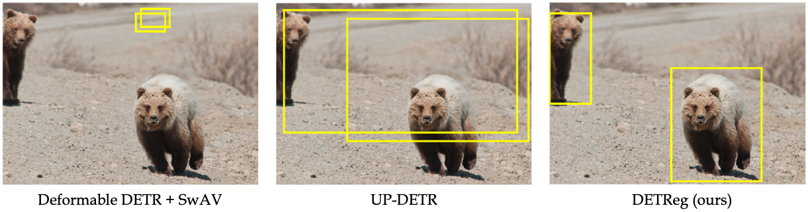

# DETReg: Unsupervised Pretraining with Region Priors for Object Detection
### [Amir Bar](https://amirbar.net), [Xin Wang](https://xinw.ai/), [Vadim Kantorov](http://vadimkantorov.com/), [Colorado J Reed](https://people.eecs.berkeley.edu/~cjrd/), [Roei Herzig](https://roeiherz.github.io/), [Gal Chechik](https://chechiklab.biu.ac.il/), [Anna Rohrbach](https://anna-rohrbach.net/), [Trevor Darrell](https://people.eecs.berkeley.edu/~trevor/), [Amir Globerson](http://www.cs.tau.ac.il/~gamir/)

  

This repository is the implementation of DETReg, see [Project Page](https://amirbar.net/detreg).

## Release
- [x] COCO training code and eval - DONE
- [x] Pretrained models - DONE
- [ ] Pascal VOC training code and eval- TODO

## Introduction

DETReg is an unsupervised pretraining approach for object **DE**tection with **TR**ansformers using **Reg**ion priors. 
Motivated by the two tasks underlying object detection: **localization** and **categorization**, we combine two complementary signals for self-supervision. For an object localization signal, we use pseudo ground truth object bounding boxes from an off-the-shelf unsupervised region proposal method, Selective Search, which does not require training data and can detect objects at a high recall rate and very low precision.
The categorization signal comes from an object embedding loss that encourages invariant object representations, from which the object category can be inferred. 
We show how to combine these two signals to train the Deformable DETR detection architecture from large amounts of unlabeled data. DETReg improves the performance over competitive baselines and previous self-supervised methods on standard benchmarks like MS COCO and PASCAL VOC. DETReg also outperforms previous supervised and unsupervised baseline approaches on low-data regime when trained with only 1%, 2%, 5%, and 10% of the labeled data on MS COCO.

## Installation

### Requirements

* Linux, CUDA>=9.2, GCC>=5.4
  
* Python>=3.7

    We recommend you to use Anaconda to create a conda environment:
    ```bash
    conda create -n detreg python=3.7 pip
    ```
    Then, activate the environment:
    ```bash
    conda activate detreg
    ```
    Installation: (change cudatoolkit to your cuda version. For detailed pytorch installation instructions click [here](https://pytorch.org/))
    ```bash
    conda install pytorch==1.8.0 torchvision==0.9.0 torchaudio==0.8.0 cudatoolkit=10.2 -c pytorch
    ```
  
* Other requirements
    ```bash
    pip install -r requirements.txt
    ```

### Compiling CUDA operators
```bash
cd ./models/ops
sh ./make.sh
# unit test (should see all checking is True)
python test.py
```

## Usage

### Dataset preparation


Please download [COCO 2017 dataset](https://cocodataset.org/) and [ImageNet](https://image-net.org/challenges/LSVRC/2012/) and organize them as following:
```
code_root/
└── data/
    ├── ilsvrc/
          ├── train/
          └── val/
    └── MSCoco/
        ├── train2017/
        ├── val2017/
        └── annotations/
        	├── instances_train2017.json
        	└── instances_val2017.json
```
Note that in this work we used the ImageNet100 dataset, which is x10 smaller than ImageNet. To create ImageNet100 run the following command:
```bash
mkdir -p data/ilsvrc100/train
mkdir -p data/ilsvrc100/val
while read line; do ln -s <code_root>/data/ilsvrc/train/$line <code_root>/data/ilsvrc100/train/$line; done < <code_root>/datasets/category.txt
while read line; do ln -s <code_root>/data/ilsvrc/val/$line <code_root>/data/ilsvrc100/val/$line; done < <code_root>/datasets/category.txt
```

This should results with the following structure:
```
code_root/
└── data/
    ├── ilsvrc/
          ├── train/
          └── val/
    ├── ilsvrc100/
          ├── train/
          └── val/
    └── MSCoco/
        ├── train2017/
        ├── val2017/
        └── annotations/
        	├── instances_train2017.json
        	└── instances_val2017.json
```
### Create ImageNet Selective Search boxes:
Download the precomputed ImageNet boxes and extract in the cache folder:
```
mkdir -p <code_root>/cache/ilsvrc && cd <code_root>/cache/ilsvrc 
wget https://github.com/amirbar/DETReg/releases/download/1.0.0/ss_box_cache.tar.gz
tar -xf ss_box_cache.tar.gz
```

### Alternatively, you can compute Selective Search boxes yourself:
To create selective search boxes for ImageNet100 on a single machine, run the following command (set num_processes): 
```bash
python -m datasets.cache_ss --dataset imagenet100 --part 0 --num_m 1 --num_p <num_processes_to_use> 
```
To speed up the creation of boxes, change the arguments accordingly and run the following command on each different machine: 
```bash
python -m datasets.cache_ss --dataset imagenet100 --part <machine_number> --num_m <num_machines> --num_p <num_processes_to_use> 
```

The cached boxes are saved in the following structure:
```
code_root/
└── cache/
    └── ilsvrc/
```

### Training

The command for pretraining DETReg on 8 GPUs on ImageNet100 is as following:
```bash
GPUS_PER_NODE=8 ./tools/run_dist_launch.sh 8 ./configs/DETReg_top30_in100.sh --batch_size 24 --num_workers 8
```
Training takes around 1.5 days with 8 NVIDIA V100 GPUs, you can download a pretrained model (see below) if you want to skip this step.

After pretraining, a checkpoint is saved in ```exps/DETReg_top30_in100/checkpoint.pth```. To fine tune it over different coco settings use the following commands:
Fine tuning on full COCO (should take 2 days with 8 NVIDIA V100 GPUs):
```bash
GPUS_PER_NODE=8 ./tools/run_dist_launch.sh 8 ./configs/DETReg_fine_tune_full_coco.sh
```
For smaller subsets which trains faster, you can use smaller number of gpus (e.g 4 with batch size 2)/
Fine tuning on 1%
```bash
GPUS_PER_NODE=4 ./tools/run_dist_launch.sh 4 ./configs/DETReg_fine_tune_1pct_coco.sh --batch_size 2
```
Fine tuning on 2%
```bash
GPUS_PER_NODE=4 ./tools/run_dist_launch.sh 4 ./configs/DETReg_fine_tune_2pct_coco.sh --batch_size 2
```
Fine tuning on 5%
```bash
GPUS_PER_NODE=4 ./tools/run_dist_launch.sh 4 ./configs/DETReg_fine_tune_5pct_coco.sh --batch_size 2
```
Fine tuning on 10%
```bash
GPUS_PER_NODE=4 ./tools/run_dist_launch.sh 4 ./configs/DETReg_fine_tune_10pct_coco.sh --batch_size 2
```


### Evaluation

To evaluate a finetuned model, use the following command from the project basedir:

```bash
./configs/<config file>.sh --resume exps/<config file>/checkpoint.pth --eval
```

### Pretrained Models

- [Pretrained ImageNet weights](https://github.com/amirbar/DETReg/releases/download/1.0.0/checkpoint_imagenet.pth) 
- [Finetuned COCO weights](https://github.com/amirbar/DETReg/releases/download/1.0.0/full_coco_finetune.pth)


## Citation
If you found this code helpful, feel free to cite our work: 

```bibtext
@misc{bar2021detreg,
      title={DETReg: Unsupervised Pretraining with Region Priors for Object Detection},
      author={Amir Bar and Xin Wang and Vadim Kantorov and Colorado J Reed and Roei Herzig and Gal Chechik and Anna Rohrbach and Trevor Darrell and Amir Globerson},
      year={2021},
      eprint={2106.04550},
      archivePrefix={arXiv},
      primaryClass={cs.CV}
}
```

## Related Works
If you found DETReg useful, consider checking out these related works as well: [ReSim](https://github.com/Tete-Xiao/ReSim), [SwAV](https://github.com/facebookresearch/swav), [DETR](https://github.com/facebookresearch/detr), [UP-DETR](https://github.com/dddzg/up-detr), and [Deformable DETR](https://github.com/fundamentalvision/Deformable-DETR).

## Acknowlegments
DETReg builds on previous works code base such as [Deformable DETR](https://github.com/fundamentalvision/Deformable-DETR) and [UP-DETR](https://github.com/dddzg/up-detr). If you found DETReg useful please consider citing these works as well.

## License
DETReg is released under the Apache 2.0 license. Please see the [LICENSE](https://github.com/amirbar/DETReg/blob/main/LICENSE) file for more information.
